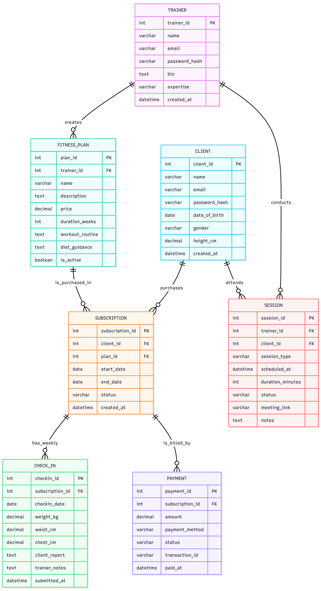

# ER Diagram — Fitness Influencer Coaching Platform

This repository contains an Entity-Relationship (ER) diagram for the Fitness Influencer Coaching Platform.

Files included

- `mermaid.mmd` — the Mermaid source for the ER diagram (editable).  
- `mmd.png` — a rendered image of the diagram (preview image included below).

Preview



What this README provides

- A short description of the diagram and purpose.
- Instructions to view or render `mermaid.mmd` locally.

How to view the Mermaid source

1. VS Code (recommended)
   - Install a Mermaid/Markdown preview extension such as "Mermaid Markdown Preview" or "Markdown Preview Enhanced" or "vscode-mermaid-preview".
   - Open `mermaid.mmd` in the editor and use the extension's preview command to render the diagram.

2. Using the Mermaid CLI (render to PNG/SVG)

   Install the mermaid CLI (requires Node.js/npm):

```zsh
npm install -g @mermaid-js/mermaid-cli
```

   Render the diagram to a PNG:

```zsh
mmdc -i mermaid.mmd -o output.png
```

   Or render to SVG:

```zsh
mmdc -i mermaid.mmd -o output.svg
```

3. Online editors
   - Copy the contents of `mermaid.mmd` and paste into the Mermaid Live Editor (https://mermaid.live/) for quick previews and exports.

Notes and assumptions

- This `README.md` assumes `mermaid.mmd` is the canonical source for the ER diagram and `mmd.png` is a corresponding rendered image.
- If you want a different output size, format, or higher DPI, pass the appropriate options to the CLI (see `mmdc --help`).

Contact / Next steps

- If you want, I can:  
  - generate a higher-resolution PNG or SVG and add it to the repo,  
  - extract and list the entities/attributes from the diagram into a text file, or  
  - Convert the diagram into SQL DDL (CREATE TABLE statements) if you share naming/typing preferences.

License

This file is provided under the MIT license. Replace or change as needed.
